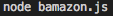
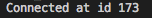
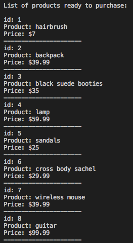
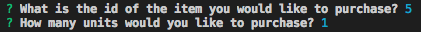
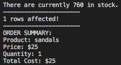
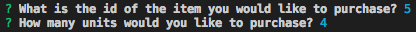
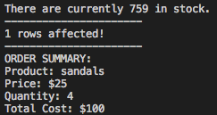

# bamazon
bamazon is a command line app(CLI) that mimics the marketplace functionality of amazon.

### MODIFICATIONS:
In [bamazon.js](./bamazon.js):
1. bamazon will run on port 3306 by default.  If your local device requires a different port, you will need to change the port value on line 7.
2. You may also need to change the password for MySQL on line 8.

In [bamazonDB.sql](./bamazonDB.sql):
1. There are 8 seed data entries so far.  If you would like to change those, or add more, you may do so in this file.

### SET UP:
1. Clone this repository
2. In the command line: cd into the bamazon folder, install the packages needed in package.json by running
```npm i```
3. Create the database and table used by running [bamazonDB.sql](./bamazonDB.sql) in MySQL 
    * [MySQL Workbench](https://dev.mysql.com/downloads/workbench/)

*Now you are ready to use the app on your machine.*

### TO USE THIS APP:
1. In command line: 


#### Results Demo:  <br>
 <br>
     - Verifies that you are connected to MySQL through your local port (id number will vary)<br><br><br>
<br>
     - Shows the id, product, and price of each item for sale in the database<br><br><br>
<br>
     - Inquirer collects data from the user<br><br><br>
<br>
     - Shows how many of the selected item are in stock, change made to SQL database, and order summary<br><br><br>

#### Lets try another purchase: <br>
<br>
     - Notice this time, we are purchasing the same product, but we are purchasing more than one.<br><br><br>
<br>
     - Because our first purchase updated the database, we went from 760 items in stock to 759.<br>
     - Also, notice that since we bought 4 this time, the total price is $100($25 per pair).<br><br><br>     
